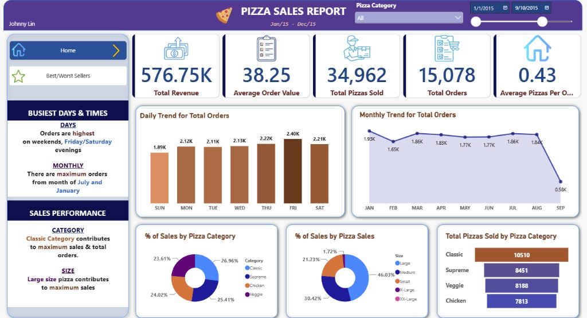
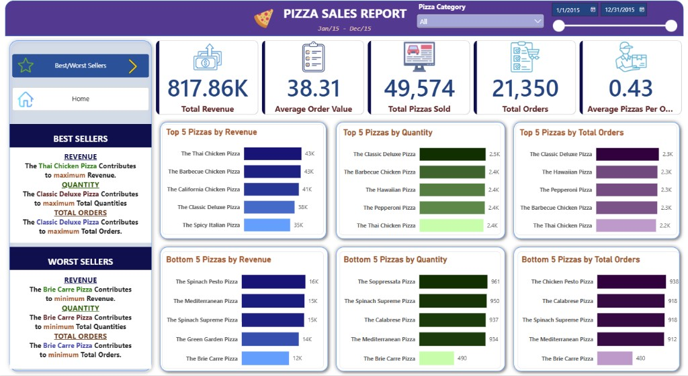

# Pizza Sales Report — SQL & Power BI Portfolio Project

End-to-end data analyst project analyzing **Maven Analytics Pizza Place** sales for **January–December 2015**. SQL queries validate KPIs and chart logic in Microsoft SQL Server; Power BI delivers an interactive two-page dashboard.

**Author:** Johnny Lin  

---

## Dashboard Preview

### Home



### Best / Worst Sellers



---


## Project Overview


| Layer          | Role                                                                        |
| -------------- | --------------------------------------------------------------------------- |
| **SQL Server** | Load CSV, clean dates, answer business questions, validate Power BI numbers |
| **Power BI**   | KPI cards, trends, category/size mix, top & bottom sellers, slicers         |


**Dataset columns:** `pizza_id`, `order_id`, `pizza_name_id`, `quantity`, `order_date` → `cleaned_date`, `order_time`, `unit_price`, `total_price`, `pizza_size`, `pizza_category`, `pizza_ingredients`, `pizza_name`

---


## Repository Contents


| File                              | Description                              |
| --------------------------------- | ---------------------------------------- |
| `pizza_sales.csv`                 | Raw pizza sales data (~48.6k rows)       |
| `pizza_sales_excel_file.csv`      | Alternate/export CSV                     |
| `pizza_queries.sql`               | Date cleanup + all KPI and chart queries |
| `assets/dashboard-home.png`       | Home page screenshot                     |
| `assets/dashboard-best-worst.png` | Best/Worst Sellers screenshot            |


---


## Setup

1. Install **SQL Server** + **SSMS**, and **Power BI Desktop**.
2. Create a database (e.g. `PizzaDB`) and import `pizza_sales.csv` into a table named `pizza_sales`.
3. Run the **data prep** section of `pizza_queries.sql` once (adds `cleaned_date`, drops the original `order_date`).
4. Run the remaining queries to validate metrics.
5. In Power BI, connect to SQL Server (or the CSV), recreate the measures in DAX, and build the two report pages.

---


## Problem Statements

Each statement maps to a query in `pizza_queries.sql` and a visual on the dashboard.

### A. Key Performance Indicators (both pages)


| ID     | Problem statement                                   | SQL approach                                  | Full-year result (approx.) |
| ------ | --------------------------------------------------- | --------------------------------------------- | -------------------------- |
| **A1** | What is the **total revenue** from all pizza sales? | `SUM(total_price)`                            | **817.86K**                |
| **A2** | What is the **average order value**?                | `SUM(total_price) / COUNT(DISTINCT order_id)` | **38.31**                  |
| **A3** | How many **pizzas were sold** in total?             | `SUM(quantity)`                               | **49,574**                 |
| **A4** | How many **distinct orders** were placed?           | `COUNT(DISTINCT order_id)`                    | **21,350**                 |
| **A5** | What is the **average number of pizzas per order**? | `SUM(quantity) / COUNT(DISTINCT order_id)`    | **2.32**                   |


> Use `COUNT(DISTINCT order_id)` — not row count — so multi-pizza orders are not over-counted.

---


### B. Home page charts


| ID      | Problem statement                                                        | Visual                          |
| ------- | ------------------------------------------------------------------------ | ------------------------------- |
| **B1**  | How do **total orders vary by day of the week**? Which days are busiest? | Daily trend (column chart)      |
| **B2**  | How do **total orders vary by month**? Is there seasonality?             | Monthly trend (line/area chart) |
| **B3**  | What **% of sales (revenue)** comes from each **pizza category**?        | Donut — % by category           |
| **B4**  | What **% of sales (revenue)** comes from each **pizza size**?            | Donut — % by size               |
| **B5**  | How many **pizzas were sold by category**?                               | Horizontal bar chart            |
| **B5b** | Same as B5, filtered to a single month (e.g. February)                   | Optional filtered check         |


**Home page insights (full year):**

- Peak order days: **Friday / Saturday** (weekend evenings)
- Peak months: **July** and **January**
- Top category by sales & quantity: **Classic**
- Top size by sales: **Large** (~46% of revenue)

---


### C. Best / Worst Sellers page


| ID     | Problem statement                               | Visual                   |
| ------ | ----------------------------------------------- | ------------------------ |
| **C1** | Which **5 pizzas generate the most revenue**?   | Top 5 by revenue         |
| **C2** | Which **5 pizzas generate the least revenue**?  | Bottom 5 by revenue      |
| **C3** | Which **5 pizzas sell the most units**?         | Top 5 by quantity        |
| **C4** | Which **5 pizzas sell the fewest units**?       | Bottom 5 by quantity     |
| **C5** | Which **5 pizzas appear on the most orders**?   | Top 5 by total orders    |
| **C6** | Which **5 pizzas appear on the fewest orders**? | Bottom 5 by total orders |


**Full-year highlights:**


| Metric       | Best seller              | Worst seller         |
| ------------ | ------------------------ | -------------------- |
| Revenue      | The Thai Chicken Pizza   | The Brie Carre Pizza |
| Quantity     | The Classic Deluxe Pizza | The Brie Carre Pizza |
| Total Orders | The Classic Deluxe Pizza | The Brie Carre Pizza |


---


## Power BI Dashboard Spec


### Shared filters

- **Pizza Category** slicer (All / Classic / Chicken / Supreme / Veggie)
- **Date range** slider on `cleaned_date`


### Page 1 — Home

1. Five KPI cards (A1–A5)
2. Daily trend for total orders (B1)
3. Monthly trend for total orders (B2)
4. % of sales by pizza category (B3)
5. % of sales by pizza size (B4)
6. Total pizzas sold by pizza category (B5)
7. Sidebar insight text summarizing busiest days/months and top category/size


### Page 2 — Best / Worst Sellers

1. Same five KPI cards (respecting filters)
2. Six ranked bar charts (C1–C6)
3. Sidebar summarizing best and worst pizzas by revenue, quantity, and orders


### Suggested DAX measures

```dax
Total Revenue = SUM(pizza_sales[total_price])

Total Orders = DISTINCTCOUNT(pizza_sales[order_id])

Average Order Value = DIVIDE([Total Revenue], [Total Orders])

Total Pizzas Sold = SUM(pizza_sales[quantity])

Average Pizzas Per Order = DIVIDE([Total Pizzas Sold], [Total Orders])
```

---


## SQL Fix Applied

After renaming `order_date` → `cleaned_date` and dropping the original column, the February category query still referenced `order_date`, which fails.

**Before (broken):**

```sql
where month(order_date) = 2
```

**After (fixed):**

```sql
where month(cleaned_date) = 2
```

Also added the missing **B3 — % of sales by pizza category** query and a full-year **B5** (category quantity without a month filter) so SQL matches the Home page visuals.

---


## Key Findings (2015, unfiltered)


| KPI                 | Value    |
| ------------------- | -------- |
| Total Revenue       | $817.86K |
| Average Order Value | $38.31   |
| Total Pizzas Sold   | 49,574   |
| Total Orders        | 21,350   |
| Avg Pizzas / Order  | 2.32     |


- **Classic** leads category mix; **Large** leads size mix.
- **Thai Chicken** and **Barbecue Chicken** lead revenue; **Classic Deluxe** leads quantity and orders.
- **Brie Carre** is the weakest performer across revenue, quantity, and orders — a candidate to promote or reconsider on the menu.

---


## Tools

- Microsoft SQL Server / SSMS  
- Power BI Desktop  
- Dataset: Maven Analytics — Pizza Place Sales (2015)

